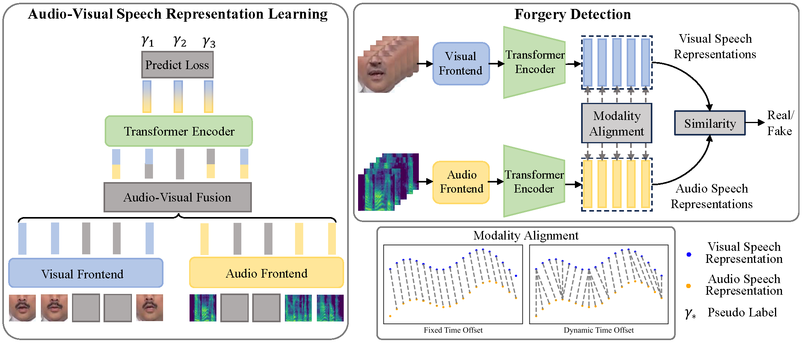

# SpeechForensics
This is a PyTorch implementation of 'SpeechForensics: Audio-Visual Speech Representation Learning for Face Forgery Detection'.


## Setup
### Prerequisite
1. `pip install torch==2.0.1+cu118 torchvision==0.15.2+cu118 -f https://download.pytorch.org/whl/torch_stable.html`
   (Choose the suitable version for your machine.)
2. Clone this repository.
3. Install dependency packages via `pip install -r requirements.txt`.
4. Install AV-HuBert and face-alignment
   ```bash
   git submodule init
   git submodule update
   ```
5. Install Fairseq
   ```
   cd av_hubert
   git submodule init
   git submodule update
   cd fairseq
   pip install --editable ./
   ```
6. Install FFmpeg. We use version=4.2.2.
7. Put the `modification/retinaface` in `preprocessing/face-alignment/face_alignment/detection`
   ```bash
   cp -r modification/retinaface preprocessing/face-alignment/face_alignment/detection
   ```
   Copy the `modification/landmark_extract.py` to `preprocessing/face-alignment/landmark_extract.py`
   ```bash
   cp modification/landmark_extract.py preprocessing/face-alignment
   ```

### Prepare data
1. Follow the links below to download the datasets (you will be asked to fill out some forms before downloading):
    * [FaceForensics++](https://github.com/ondyari/FaceForensics) (Download the [audio](https://github.com/ondyari/FaceForensics/tree/master/dataset#audio) according to the youtube ids and extract audio clips using the frame numbers that can obtained by downloading the 'original_youtube_videos_info'. )
    * [FakeAVCeleb](https://github.com/DASH-Lab/FakeAVCeleb)
    * [KoDF](https://github.com/deepbrainai-research/kodf)
2. Place the videos in the corresponding directories.
   ```
   your_dataset_root
   |--FaceForensics
      |--c23
         |--Deepfakes
            |--videos
               |--000.mp4
   |--FakeAVCeleb
      |--videos
         |--RealVideo-RealAudio
            |--Africa
               |--man
   ```
    * The directory structure of FaceForensics++: `your_dataset_root/FaceForensics/{compression}/{categories}/videos/{video}`,
    where `categorise` is `real`, `fake/Deepfakes`, `fake/FaceSwap`, `fake/Face2Face` or `fake/NeuralTextures`. `compression` is `c0`, `c23` or `c40`.
    The test videos we used in our experiments are given in `data/datasets/FaceForensics/test_list.txt`.
    * The directory structure of FakeAVCeleb: `your_dataset_root/FakeAVCeleb/videos/{categories}/{ethnic}/{gender}/{id}/{video}`,
      where `categories` includes `RealVideo-RealAudio`, `RealVideo-FakeAudio`, `FakeVideo-RealAudio` and `FakeVideo-FakeAudio`.
      For example, `your_dataset_root/FakeAVCeleb/videos/RealVideo-RealAudio/African/men/id00076/00109.mp4`.
    * The directory structure of KoDF: `your_dataset_root/KoDF/videos/{categories}/{id}/{video}`,
      where `categories` includes `original_videos`, `audio-driven`, `dffs`, `dfl` and `fo` (The videos we downloaded in `fsgan` do not contain audio,
      so we couldn't test them).
      The test videos we used in our experiments are given in `data/datasets/KoDF/test_list.txt`
4. Detect the faces and extract 68 face landmarks. Download the [RetinaFace](https://drive.google.com/open?id=1oZRSG0ZegbVkVwUd8wUIQx8W7yfZ_ki1) pretrained model,
   and put it to `checkpoints/Resnet50_Final.pth`. Run
   ```bash
   python preprocessing/face-alignment/landmark_extract.py --video_root $video_root --file_list $file_list --out_dir $out_dir
   ```
   - $video_root: root directory of videos.
   - $file_list: a txt file containing names of videos. We provide the filelists in the `data/datasets/` directory.
   - $out_dir: directory for saving landmarks.
5. To crop the mouth region from each video, run
   ```bash
   python preprocessing/align_mouth.py --video_root $video_root --file_list $file_list --landmarks_dir $landmarks_dir --out_dir $out_dir
   ```
   - $out_dir: directory for saving cropped mouth videos.


## Evaluate
1. Download the pretrained Audio-Visual Speech Representation model [here](https://dl.fbaipublicfiles.com/avhubert/model/lrs3_vox/clean-pretrain/large_vox_iter5.pt).
   And put it to `checkpoints/large_vox_iter5.pt`.
2. To evaluate on different datasets, run
   ```bash
   python evaluation/evaluate.py --video_root $video_root --file_list $file_list --mouth_dir $cropped_mouth_dir
   ```
   The AUC scores of different forgery datasets are shown in below:

   | FaceForensic++ | FakeAVCeleb | KoDF |
   | :------------: | :-------------: | :-------------: |
   | 97.6% | 99.0% | 91.7% |
